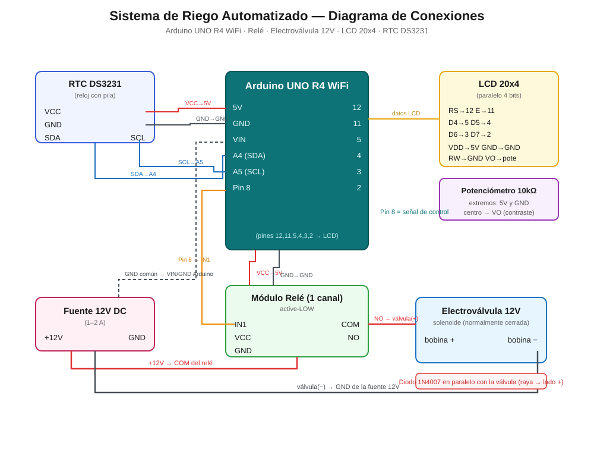

# Sistema de Riego Automatizado con Arduino UNO R4 WiFi

Controlador de riego automatizado de bajo costo para áreas verdes, basado en **Arduino UNO R4 WiFi**. Acciona una electroválvula de 12 V mediante un módulo de relé según una programación de días, hora y duración, mostrando además texto en una pantalla LCD 20x4. El diseño busca reemplazar el riego manual con manguera, reduciendo el desperdicio de agua y garantizando un riego constante en el horario de menor evaporación.

Desarrollado como proyecto de servicio comunitario para el **Centro Santísima Trinidad** (Hermosillo, Sonora, México) y publicado como diseño abierto para que cualquier persona o institución pueda replicarlo.

---

## Características

- Programación de **días específicos, hora de inicio y duración** del riego.
- Funciona **sin conexión a internet**.
- Tres variantes de firmware según la necesidad (ver abajo).
- Pantalla LCD 20x4 con marquesina de texto.
- Lógica *fail-safe*: la válvula arranca siempre cerrada.
- Componentes económicos y fáciles de conseguir.

## Ahorro estimado de agua

Frente al riego manual con manguera, la entrega controlada de agua (solo el tiempo necesario, en el horario de menor evaporación) representa un ahorro estimado de **entre 40% y 60%** en el consumo de agua, además de un desarrollo más uniforme de la vegetación. *(Cifra estimada, no medición certificada.)*

---

## Variantes de firmware

El repositorio incluye tres versiones en `firmware/`. Todas comparten el mismo hardware base; elige una según lo que necesites:

| Carpeta | Reloj | Requiere | Comportamiento |
|---|---|---|---|
| `riego_ds3231/` | Módulo **DS3231** externo | Módulo DS3231 (con pila) | Riega a una **hora fija** en los días marcados. Mantiene la hora aunque se corte la luz. **Recomendada para instalación permanente.** |
| `riego_reloj_interno/` | RTC **interno** del R4 | (Opcional) pila CR2032 en pin VRTC | Igual que la anterior pero usando el reloj integrado de la placa, sin módulo externo. |
| `riego_cada24h/` | Ninguno (cuenta `millis()`) | Nada extra | Riega **cada 24 h** contadas desde el encendido. La más simple; no necesita poner la hora. |

---

## Lista de materiales (BOM)

| Componente | Cantidad | Notas |
|---|---|---|
| Arduino UNO R4 WiFi | 1 | Placa principal |
| Módulo relé 1 canal | 1 | Tipo *active-LOW* |
| Electroválvula solenoide 12 V DC | 1 | Normalmente cerrada |
| Fuente 12 V DC | 1 | 1–2 A |
| Diodo 1N4007 | 1 | *Flyback*, en paralelo con la válvula |
| Pantalla LCD 20x4 (paralela) | 1 | Modo 4 bits |
| Potenciómetro 10 kΩ | 1 | Contraste de la LCD |
| Resistencia 220 Ω | 1 | Backlight de la LCD |
| Módulo RTC DS3231 | 1 | Solo para la variante `riego_ds3231` |
| Cable calibre grueso (≥ 2.5 mm² / AWG 14) | según distancia | Para el tramo de 12 V hacia la válvula |

> **Sobre la distancia a la válvula:** para tramos largos (p. ej. 40–60 m) entre el relé y la válvula, usa cable **grueso** (≥ 2.5 mm²). Al ser 12 V DC de baja corriente la caída de voltaje es mínima, pero un cable delgado se calienta y puede fallar.

---

## Diagrama de conexiones

### Tabla de conexiones

**Relé**
| Relé | Va a |
|---|---|
| IN1 | Pin 8 del Arduino |
| VCC | 5V |
| GND | GND |
| COM | +12V de la fuente |
| NO | Bobina (+) de la válvula |

La bobina (−) de la válvula va al **GND de la fuente de 12 V**. El **diodo 1N4007** se coloca en paralelo con la válvula (raya/cátodo hacia el lado +).

**LCD 20x4 (paralelo, 4 bits)**
| LCD | Arduino |
|---|---|
| RS | 12 |
| E | 11 |
| D4 | 5 |
| D5 | 4 |
| D6 | 3 |
| D7 | 2 |
| VDD | 5V |
| VSS / RW / BLK | GND |
| VO | Centro del potenciómetro (extremos a 5V y GND) |
| BLA | 5V a través de resistencia de 220 Ω |

**DS3231 (solo variante `riego_ds3231`)**
| DS3231 | Arduino |
|---|---|
| VCC | 5V |
| GND | GND |
| SDA | A4 |
| SCL | A5 |

---

## Instalación

1. Instala el [Arduino IDE](https://www.arduino.cc/en/software) y el paquete de placas **Arduino UNO R4** (Boards Manager → "Arduino UNO R4 Boards").
2. Abre la carpeta de la variante que elijas dentro de `firmware/`.
3. Instala las librerías necesarias desde el Gestor de Bibliotecas:
   - `riego_ds3231/` → **RTClib** (de Adafruit)
   - `riego_reloj_interno/` y `riego_cada24h/` → ninguna extra (`LiquidCrystal` ya viene incluida)
4. Selecciona la placa **Arduino UNO R4 WiFi** y el puerto correspondiente.
5. Ajusta la configuración al inicio del sketch (días, hora, duración) y sube el código.

> **Consejo:** para probar sin esperar, reduce temporalmente la duración a 1 minuto y verifica que el relé encienda y apague solo antes de dejar la instalación definitiva.

---

## Licencia

- **Código / firmware:** [MIT](LICENSE)
- **Documentación, diagramas e imágenes:** [Creative Commons Attribution 4.0 (CC BY 4.0)](https://creativecommons.org/licenses/by/4.0/)

Puedes usar, modificar y redistribuir este proyecto libremente, incluso con fines comerciales, siempre conservando el aviso de autoría.

---

## Créditos

Diseño, electrónica y programación: **Mariano Ernesto Ramírez Lozano**.
Proyecto de servicio comunitario para el Centro Santísima Trinidad (CEFODEH), Hermosillo, Sonora, México.

Si replicas o mejoras este sistema, ¡las contribuciones y *forks* son bienvenidos!
